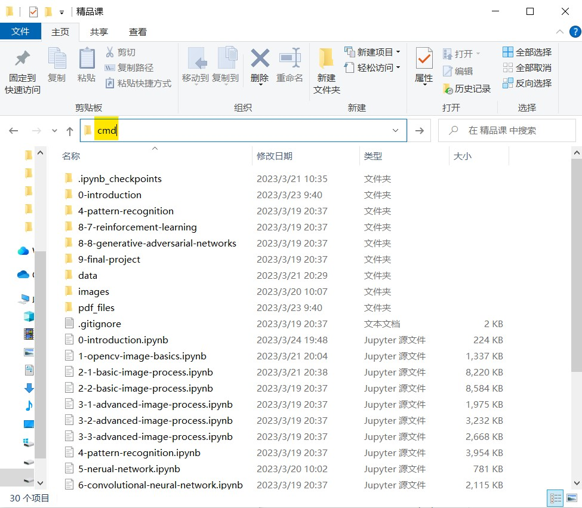

# Vision2022

**Slides of "Machine Vision" course by Zhejiang University Student Smart Factory Innovation Club**

**浙江大学学生智能工厂创新俱乐部《智能工厂软机器视觉教学》社团精品课程**

**Course Website: https://lebronlihd.github.io/Vision2022/**

### Course Outline for CV Section

- Image basics: Pixels, Colors, Image formats
- Image processing techniques: Filtering, Binarization, cutting, Morphological transformation, Scale and rotation transformation, Image gradient
- Image pattern recognition: Line and circle detection, Feature point detection, Edge detection
- Image pattern recognition: Blob detection, Feature point detection, Template matching

### CV部分课程大纲

- 图像基本知识：像素、色彩、图像格式
- 图像处理技术：滤波、二值化、切割、形态学变换，尺度与旋转变换、图像梯度
- 图像模式识别：直线与圆的检测、特征点检测、边缘检测
- 图像模式识别：Blob检测、特征点检测、模板匹配

### Usage
- if you are new to **Python**、**jupyter notebook** or **markdown**，You can refer to this [link](https://lebronlihd.github.io/blog/2022/basic-tutorial/)

- Here is a simple usage for **Windows** users:

  * Download the entire file compression package from GitHub and extract it to the specified directory.

  * Open the terminal in the directory where the file is located.

    

  * activate the environment configured for this class and open jupyter notebook in terminal

    * If you have not yet configured the environment required for this course, please refer to the '0-introduction.ipynb' file.

    * type in your terminal:

      `conda activate <environment name> | jupyter notebook`

    * Then the interface of jupyter notebook will be displayed on your browser.

### Reference

- Zhang, A., Lipton, Z., Li, M., & Smola, A. (2021). Dive into Deep Learning. arXiv preprint arXiv:2106.11342.
