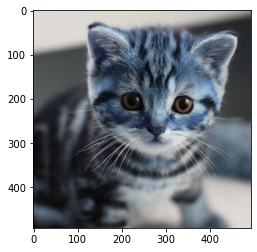
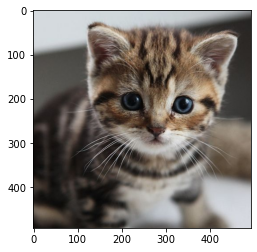

# Introduction

&copy; 李浩东 3190104890@zju.edu.cn

&copy; 孙正男 3190102989@zju.edu.cn


## Basic Information

- ***Soft Machine Vision***
- Smart Factory Innovation Club of Zhejiang University
- Class locations: 紫金港月牙楼301
- Class time: Sunday 9:30 to 11:30
- Number of students enrolled: 42

## Course Outline

- Image basics: Pixels, Colors, Image formats
- Image processing techniques: Filtering, Binarization, cutting, Morphological transformation, Scale and rotation transformation, Image gradient
- Image pattern recognition: Line and circle detection, Feature point detection, Edge detection
- Image pattern recognition: Blob detection, Feature point detection, Template matching
- Neural Network basics: Neuron structure, Multi-layer Perceptron, Handwritten digit recognition, Loss function
- Neural Network basics: Gradient Descent, Backpropagation
- Modern Neural Network: Softmax regression, Deep neural network, Convolutional Neural Network, Server Resources
- Modern Neural Network: Recurrent Neural Networks, Attention Mechanism & Transformer, Natural Language Processing, Reinforcement Learning, Generative Adversarial Networks
- Final project and Q&A: Chess board recognition system

## Configuration (pip)

- Python3.9 [[LINK](https://www.python.org/)]
- Remember to add Python to `PATH` and environment variables
- Install required packages
    - **CPU:** `pip install -r ./0-introduction/requirements_cpu.txt`
    - **GPU (CUDA 11.3):** `pip install -r ./0-introduction/requirements_gpu.txt`
- Please be aware of the dependencies if you have more than one Python installed
- VS Code [[LINK](https://code.visualstudio.com/)] (optional)
    - Config Python3.9 in your VS Code


## Configuration (Miniconda)

- Miniconda installation package download [[LINK](https://docs.conda.io/en/main/miniconda.html#latest-miniconda-installer-links)]
- Open terminal in `Vision2022/`
    - Create a virtual environment and install required packages (replace `<environment name>` with a name given by you, e.g. `vision`)
    - `conda create -n <environment name> python=3.9`
    - Activate the virtual environment
    - `conda activate <environment name>`
    - Install required packages
    - **CPU:** `pip install -r ./0-introduction/requirements_cpu.txt`
    - **GPU (CUDA 11.3):** `pip install -r ./0-introduction/requirements_gpu.txt`

## Test configuration

- Run `python ./0-introduction/show_a_cat.py` under `Vision2022/`
    - Press `Esc` or `q` on the keyboard to close the window


```python
import sys

print(sys.version)
```

    3.9.16 (main, Mar  8 2023, 10:39:24) [MSC v.1916 64 bit (AMD64)]


```python
import torch
import tensorflow as tf

print(torch.cuda.is_available())
# let's see the list of CUDA architectures, and the device name
if torch.cuda.is_available():
    print(torch.cuda.get_device_name(device=None), torch.cuda.get_arch_list())
print(tf.test.is_gpu_available())
# tf.test.is_gpu_available() is deprecated and will be removed soon
tf.config.list_physical_devices('GPU') 
```

    True
    NVIDIA GeForce RTX 3060 Laptop GPU ['sm_37', 'sm_50', 'sm_60', 'sm_61', 'sm_70', 'sm_75', 'sm_80', 'sm_86', 'compute_37']
    WARNING:tensorflow:From C:\Users\lebro\AppData\Local\Temp\ipykernel_19472\519669526.py:8: is_gpu_available (from tensorflow.python.framework.test_util) is deprecated and will be removed in a future version.
    Instructions for updating:
    Use `tf.config.list_physical_devices('GPU')` instead.
    True


    [PhysicalDevice(name='/physical_device:GPU:0', device_type='GPU')]


```python
import cv2
import numpy as np
import matplotlib.colors as mat_color

print(cv2.__version__)

# read the cat image
path = "./images/cat.jpg"
img_bgr = cv2.imread(path) 

print(type(img_bgr))
print(np.shape(img_bgr))
```

    4.7.0
    <class 'numpy.ndarray'>
    (493, 493, 3)


```python
from matplotlib import pyplot as plt

# display img
no_norm = mat_color.Normalize(vmin=0, vmax=255, clip=False)
plt.imshow(img_bgr, norm=no_norm)
```


    <matplotlib.image.AxesImage at 0x7ff9561ede80>


    

    


```python
# bgr -> rgb
img_rgb = cv2.cvtColor(img_bgr, cv2.COLOR_BGR2RGB)
plt.imshow(img_rgb, norm=no_norm)
```


    <matplotlib.image.AxesImage at 0x7ff954150040>


    

    


```python
import os

# save the img in csv format
os.makedirs('../data', exist_ok=True)
data_file = os.path.join('../data', 'cat.csv')
print(data_file)
with open(data_file, 'w') as f:
    f.write('R,G,B\n')
    for row in img_rgb:
        for rgb in row:
            f.write(str(rgb[0]) + ',' + str(rgb[1]) + ',' + str(rgb[2]) + '\n')
```

    ../data/cat.csv


## The End

2022.3
